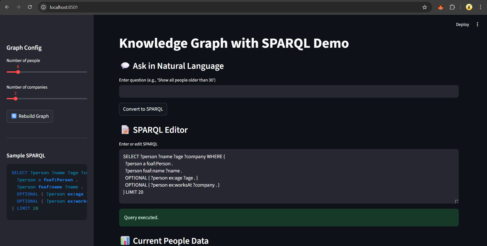
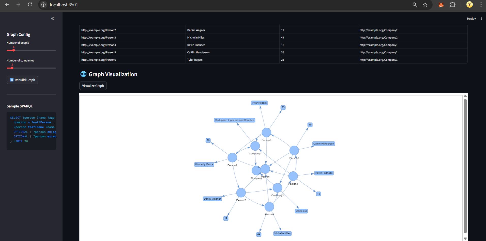

#  Knowledge Graph Demo with SPARQL and Triple Store

This project is an **interactive demo application** for building, exploring, and modifying a **Knowledge Graph (KG)** using:

* **[rdflib](https://rdflib.readthedocs.io/)** — in-memory RDF graph and SPARQL execution.
* **[Faker](https://faker.readthedocs.io/)** — generate dummy people and company data.
* **[Streamlit](https://streamlit.io/)** — interactive web interface.
* **[PyVis](https://pyvis.readthedocs.io/)** — graph visualization.
* **[OpenAI API](https://platform.openai.com/)** — optional natural language to SPARQL conversion(you can use any model at your convinence).



You can:

* Generate a random RDF Knowledge Graph with fake data (people, companies, relationships).  
* Execute **SPARQL SELECT, INSERT, DELETE, and UPDATE queries**.  
* See query results automatically in a table after every query.  
* Visualize the graph interactively in the browser.  
* Ask questions in natural language and convert them into SPARQL queries.

This demonstrates building RDF and interacting with graph databases with SPARQL and converting natural language to querying.

---

## Features

* Build an in-memory RDF Knowledge Graph with dummy data.
* Predefined namespaces (`ex`, `foaf`, `rdfs`, `rdf`) are auto-injected into queries.
* Run **SPARQL SELECT / CONSTRUCT / INSERT / DELETE / UPDATE** queries.
* Automatic table display after each query execution.
* Confirmation step for destructive queries (DELETE/UPDATE).
* NL → SPARQL conversion using OpenAI GPT models.
* Interactive graph visualization of people and companies with PyVis.
* Sidebar controls to rebuild the graph with configurable size.

---


## Project Structure

```

KG/
├─ src/
│  ├─ app.py             # Main Streamlit application
│  ├─ data_builder.py    # Builds the dummy RDF graph with Faker
│  ├─ sparql_service.py  # Executes SPARQL queries (handles SELECT/UPDATE/INSERT/DELETE)
│  ├─ visualizer.py      # Graph visualization using PyVis
│  └─ nl2sparql.py       # Converts natural language questions into SPARQL
├─ requirements.txt       # Python dependencies
└─ README.md              # This documentation

````

### File Explanations

* **`app.py`**

  * Entry point of the app.
  * UI with:
    * Natural language input → converts to SPARQL.
    * SPARQL editor with query execution.
    * Automatic display of result tables after queries.
    * Confirmation prompt for DELETE/UPDATE.
    * Graph visualization button.
  * Handles query type detection and ensures proper execution (query vs update).

* **`data_builder.py`**

  * Generates a Knowledge Graph with `Person` and `Company` nodes.
  * Adds relationships:
    * `foaf:knows` between people.
    * `ex:worksAt` linking people to companies.
  * Only executed on initial load or manual rebuild — prevents overwriting updates.

* **`sparql_service.py`**

  * Executes SPARQL queries against the graph.
  * Handles:
    * **Read queries** (SELECT, CONSTRUCT, ASK) via `graph.query()`.
    * **Modification queries** (INSERT, DELETE, UPDATE) via `graph.update()`.
  * Returns query results in a JSON-like format for easy display.

* **`visualizer.py`**

  * Converts RDF graph to a PyVis network.
  * Handles URIs, literals, and edges with labels.
  * Renders interactive graph in Streamlit.

* **`nl2sparql.py`**

  * Converts natural language questions into valid SPARQL.
  * Removes markdown or prefix lines (prefixes are automatically added).
  * Supports INSERT, DELETE, UPDATE, and SELECT queries.

* **`requirements.txt`**

  * Lists all required Python libraries (Streamlit, rdflib, pyvis, Faker, openai, python-dotenv, etc.)

---

## Installation & Run

### 1. Clone the repository

```bash
git clone <your-repo-url>
cd repo-name
````

### 2. Create virtual environment

```bash
python -m venv .venv
# Activate:
# Linux/Mac
source .venv/bin/activate
# Windows
.venv\Scripts\activate
```

### 3. Install dependencies

```bash
pip install -r requirements.txt
```

### 4. Set your OpenAI API key (optional for NL → SPARQL)

Create a `.env` file in the root folder:

```
OPENAI_API_KEY=your_openai_api_key_here
```

### 5. Run the app

```bash
streamlit run src/app.py
```

---

## How to Use

1. Open the app in your browser (Streamlit shows a local URL, usually `http://localhost:8501`).
2. **Sidebar**:

   * Choose the number of people and companies.
   * Rebuild the graph to refresh the dataset.
3. **Natural Language Input** (optional):

   * Ask questions like `Show all people older than 30`.
   * Click **Convert to SPARQL** → the generated SPARQL appears in the editor.
4. **SPARQL Editor**:

   * Modify or enter queries manually (SELECT / INSERT / DELETE / UPDATE).
   * Destructive queries (DELETE/UPDATE) require confirmation.
   * SELECT queries are executed automatically.
5. **Graph Visualization**:

   * Click **Visualize Graph** to view nodes and relationships interactively.

---

## Examples

**Add a new person:**

```sparql
INSERT DATA {
  ex:Person7 a foaf:Person ;
             foaf:name "Mugen" ;
             ex:age 23 ;
             ex:worksAt ex:Company1 .
}
```

**Delete a person:**

```sparql
DELETE {
  ex:Person6 ?p ?o .
} WHERE {
  ex:Person6 ?p ?o .
}
```

**Select all people:**

```sparql
SELECT ?person ?name ?age ?company WHERE {
  ?person a foaf:Person .
  ?person foaf:name ?name .
  OPTIONAL { ?person ex:age ?age . }
  OPTIONAL { ?person ex:worksAt ?company . }
} LIMIT 20
```

---

## Notes

* Graph updates are **persistent in memory** until you rebuild the graph.
* Destructive queries show **confirmation buttons**.
* NL → SPARQL conversion requires an **OpenAI API key**.
* Data table is refreshed **after every query** automatically.

---

